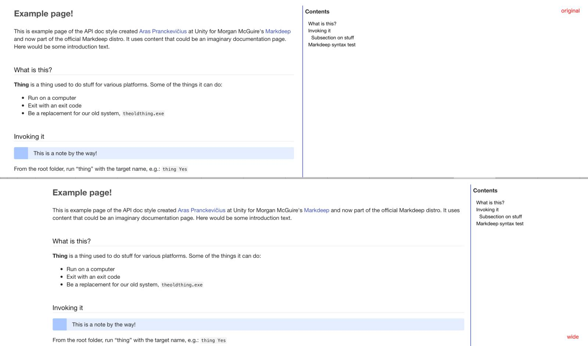

# Wide-screen firendly overlay for Markdeep styles

[Markdeep](https://casual-effects.com/markdeep/) is a great Markdown processor script
that allows you writing extended Markdown files, and have them vieweble formatted
directly in the browser. No Markdown processors to run or any of that stuff!

The default Markdeep styling in all cases (latex, apidoc, dark) is quite narrow. About 50em.
And while shorter lines are easier to read, the result in a full-screen browser on a wide-screen looks awkward.

Here's a little comparison:


To use it in your Markdeep document, just put a
```html
<link rel="stylesheet" href="https://cdn.jsdelivr.net/gh/unjello/markdeep-wide/markdeep-wide.css">
```
somewhere on the page, after your main stylesheet. Or just copy `markdeep-wide.css` locally to your folder.

## License
- Unlicense (~Public Domain)

## Related workd
- [Markdeep](https://casual-effects.com/markdeep)
